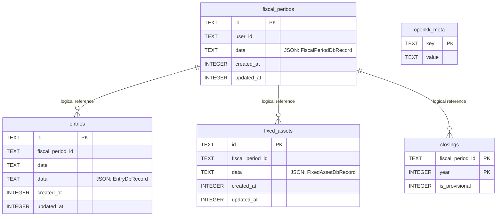

# Database Schema

標準実装の SQLite スキーマ。DDL の正本は `packages/server-ports/src/sqlite/schema.ts`。

`fiscal_period_id` は現在SQLiteの外部キー制約ではなく、アダプタがトランザクション内で整合性を管理する。DB Portと保存型は `db-adapter.ts` と `persistence-types.ts`、SQLite固有実装は `sqlite/` に分離している。

Indexes: `fiscal_periods(user_id)`, `entries(fiscal_period_id)`, `entries(fiscal_period_id, date)`, `fixed_assets(fiscal_period_id)`。
