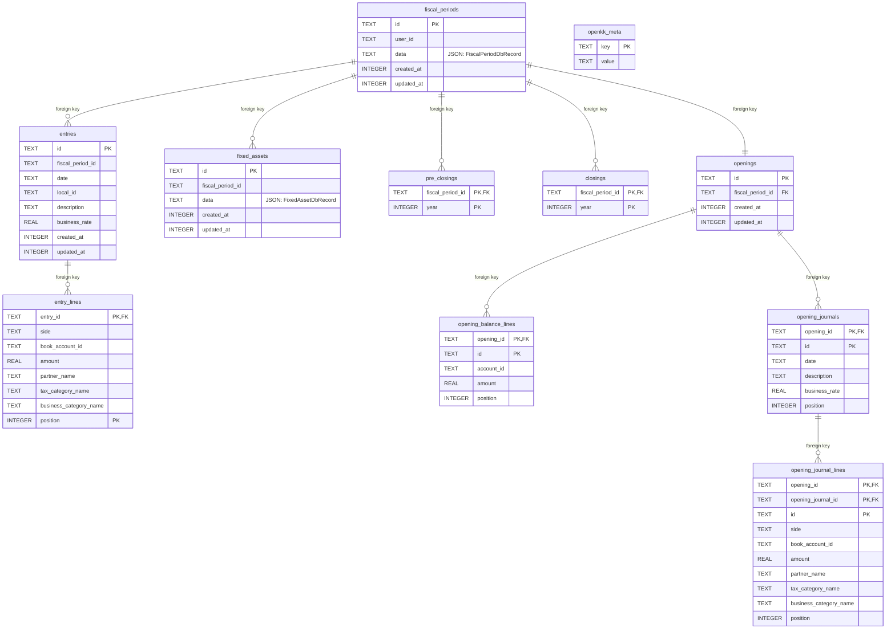

# Database Schema

標準実装の SQLite スキーマ。DDL の正本は `packages/server-ports/src/sqlite/schema.ts`。

Openingと仕訳明細は子テーブルへ正規化する。仮締めと本締めも別テーブルで管理する。

子テーブルの外部キーは期間・Opening削除時に `ON DELETE CASCADE` で削除される。残る `data` 列は `json_valid` と主要列との一致をCHECK制約で検証する。

Indexes: `fiscal_periods(user_id, created_at, id)`, Opening各行の表示順、`entries(fiscal_period_id, date, created_at, id)`, `fixed_assets(fiscal_period_id, created_at, id)`。空でない `entries.local_id` は期間内で一意。
