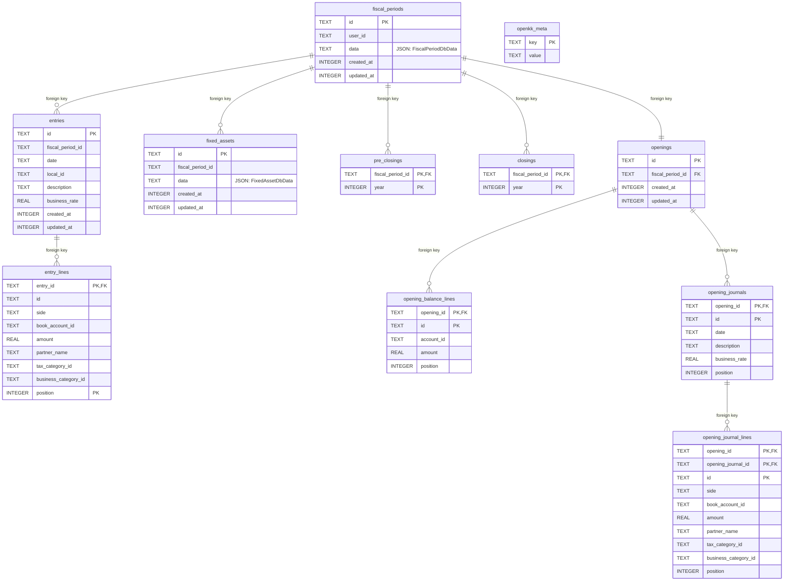

# Database Schema

標準実装の SQLite スキーマ。DDL の正本は `packages/sqlite-adapter/src/schema.ts`。

```mermaid
erDiagram
  fiscal_periods ||--o{ entries : "foreign key"
  entries ||--o{ entry_lines : "foreign key"
  fiscal_periods ||--o{ fixed_assets : "foreign key"
  fiscal_periods ||--o{ pre_closings : "foreign key"
  fiscal_periods ||--o{ closings : "foreign key"
  fiscal_periods ||--|| openings : "foreign key"
  openings ||--o{ opening_balance_lines : "foreign key"
  openings ||--o{ opening_journals : "foreign key"
  opening_journals ||--o{ opening_journal_lines : "foreign key"

  openkk_meta {
    TEXT key PK
    TEXT value
  }
  fiscal_periods {
    TEXT id PK
    TEXT user_id
    TEXT data "JSON: FiscalPeriodDbData"
    INTEGER created_at
    INTEGER updated_at
  }
  openings {
    TEXT id PK
    TEXT fiscal_period_id FK
    INTEGER created_at
    INTEGER updated_at
  }
  opening_balance_lines {
    TEXT opening_id PK,FK
    TEXT id PK
    TEXT account_id
    REAL amount
    INTEGER position
  }
  opening_journals {
    TEXT opening_id PK,FK
    TEXT id PK
    TEXT date
    TEXT description
    REAL business_rate
    INTEGER position
  }
  opening_journal_lines {
    TEXT opening_id PK,FK
    TEXT opening_journal_id PK,FK
    TEXT id PK
    TEXT side
    TEXT book_account_id
    REAL amount
    TEXT partner_name
    TEXT tax_category_id
    TEXT business_category_id
    INTEGER position
  }
  entries {
    TEXT id PK
    TEXT fiscal_period_id
    TEXT date
    TEXT local_id
    TEXT description
    REAL business_rate
    INTEGER created_at
    INTEGER updated_at
  }
  entry_lines {
    TEXT entry_id PK,FK
    TEXT id
    TEXT side
    TEXT book_account_id
    REAL amount
    TEXT partner_name
    TEXT tax_category_id
    TEXT business_category_id
    INTEGER position PK
  }
  fixed_assets {
    TEXT id PK
    TEXT fiscal_period_id
    TEXT data "JSON: FixedAssetDbData"
    INTEGER created_at
    INTEGER updated_at
  }
  pre_closings {
    TEXT fiscal_period_id PK,FK
    INTEGER year PK
  }
  closings {
    TEXT fiscal_period_id PK,FK
    INTEGER year PK
  }
```

Openingと仕訳明細は子テーブルへ正規化する。仮締めと本締めも別テーブルで管理する。

会計期間の型は読み込む範囲で3段に分かれる。`FiscalPeriodDbData` は `data` 列の中身、
`FiscalPeriodDbRow` は行そのもの（`user_id` と時刻を含む）、`FiscalPeriodDbRecord` は
Opening まで読んだ全体。子テーブルを持たない固定資産は `FixedAssetDbData` と
`FixedAssetDbRecord` の2段。

子テーブルの外部キーは期間・Opening削除時に `ON DELETE CASCADE` で削除される。残る `data` 列は `json_valid` と主要列との一致をCHECK制約で検証する。

Indexes: `fiscal_periods(user_id, created_at, id)`, Opening各行の表示順、`entries(fiscal_period_id, date, created_at, id)`, `fixed_assets(fiscal_period_id, created_at, id)`。`entries.local_id` は `null` 以外なら期間内で一意。

## マイグレーション

`SCHEMA_VERSION` は 4。起動時に不足分を順に適用する。

公開済みのマイグレーションは書き換えず、修正は新しいバージョンに分離する。
未公開のバージョンは追加せず、次に公開するバージョンへまとめる。

| version | 内容 |
|---|---|
| 1 | 初期スキーマ |
| 2 | Opening・仕訳明細・締め状態を子テーブルへ正規化 |
| 3 | `entry_lines` に明細IDを追加 |
| 4 | 税区分・事業区分をIDへ変換し、未設定値を `null` に統一 |
