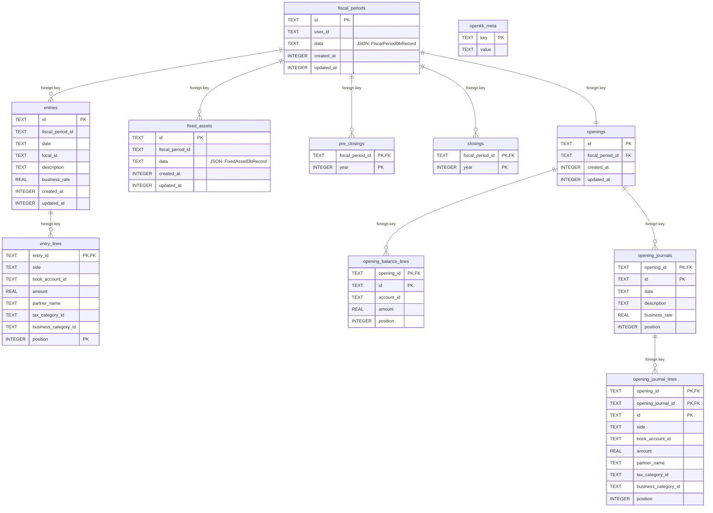

# Database Schema

標準実装の SQLite スキーマ。DDL の正本は `packages/server-ports/src/sqlite/schema.ts`。

```mermaid
erDiagram
  fiscal_periods ||--o{ entries : "foreign key"
  entries ||--o{ entry_lines : "foreign key"
  fiscal_periods ||--o{ fixed_assets : "foreign key"
  fiscal_periods ||--o{ pre_closings : "foreign key"
  fiscal_periods ||--o{ closings : "foreign key"
  fiscal_periods ||--|| openings : "foreign key"
  openings ||--o{ opening_balance_lines : "foreign key"
  openings ||--o{ opening_journals : "foreign key"
  opening_journals ||--o{ opening_journal_lines : "foreign key"

  openkk_meta {
    TEXT key PK
    TEXT value
  }
  fiscal_periods {
    TEXT id PK
    TEXT user_id
    TEXT data "JSON: FiscalPeriodDbRecord"
    INTEGER created_at
    INTEGER updated_at
  }
  openings {
    TEXT id PK
    TEXT fiscal_period_id FK
    INTEGER created_at
    INTEGER updated_at
  }
  opening_balance_lines {
    TEXT opening_id PK,FK
    TEXT id PK
    TEXT account_id
    REAL amount
    INTEGER position
  }
  opening_journals {
    TEXT opening_id PK,FK
    TEXT id PK
    TEXT date
    TEXT description
    REAL business_rate
    INTEGER position
  }
  opening_journal_lines {
    TEXT opening_id PK,FK
    TEXT opening_journal_id PK,FK
    TEXT id PK
    TEXT side
    TEXT book_account_id
    REAL amount
    TEXT partner_name
    TEXT tax_category_id
    TEXT business_category_id
    INTEGER position
  }
  entries {
    TEXT id PK
    TEXT fiscal_period_id
    TEXT date
    TEXT local_id
    TEXT description
    REAL business_rate
    INTEGER created_at
    INTEGER updated_at
  }
  entry_lines {
    TEXT entry_id PK,FK
    TEXT side
    TEXT book_account_id
    REAL amount
    TEXT partner_name
    TEXT tax_category_id
    TEXT business_category_id
    INTEGER position PK
  }
  fixed_assets {
    TEXT id PK
    TEXT fiscal_period_id
    TEXT data "JSON: FixedAssetDbRecord"
    INTEGER created_at
    INTEGER updated_at
  }
  pre_closings {
    TEXT fiscal_period_id PK,FK
    INTEGER year PK
  }
  closings {
    TEXT fiscal_period_id PK,FK
    INTEGER year PK
  }
```

Openingと仕訳明細は子テーブルへ正規化する。仮締めと本締めも別テーブルで管理する。

子テーブルの外部キーは期間・Opening削除時に `ON DELETE CASCADE` で削除される。残る `data` 列は `json_valid` と主要列との一致をCHECK制約で検証する。

Indexes: `fiscal_periods(user_id, created_at, id)`, Opening各行の表示順、`entries(fiscal_period_id, date, created_at, id)`, `fixed_assets(fiscal_period_id, created_at, id)`。空でない `entries.local_id` は期間内で一意。

## マイグレーション

`SCHEMA_VERSION` は 4。起動時に不足分を順に適用する。

**公開済みのマイグレーションは書き換えない。** v1〜v3 は v26.1.12 までに公開済みで、
既存端末のDBが適用済みのため。誤りは新しいバージョンで打ち消す。

| version | 内容 |
|---|---|
| 1 | 初期スキーマ |
| 2 | テーブル設計を正規化。v1 JSON の `taxCategoryName` / `businessCategoryName`（表示名）を `*_category_id` 列へそのまま移送 |
| 3 | `entry_lines` に明細IDを追加 |
| 4 | v2 が移送した既定区分の表示名を既定IDへ変換（`対象外` → `tax_out_of_scope` 等）。既定に無い値はそのまま残す |
