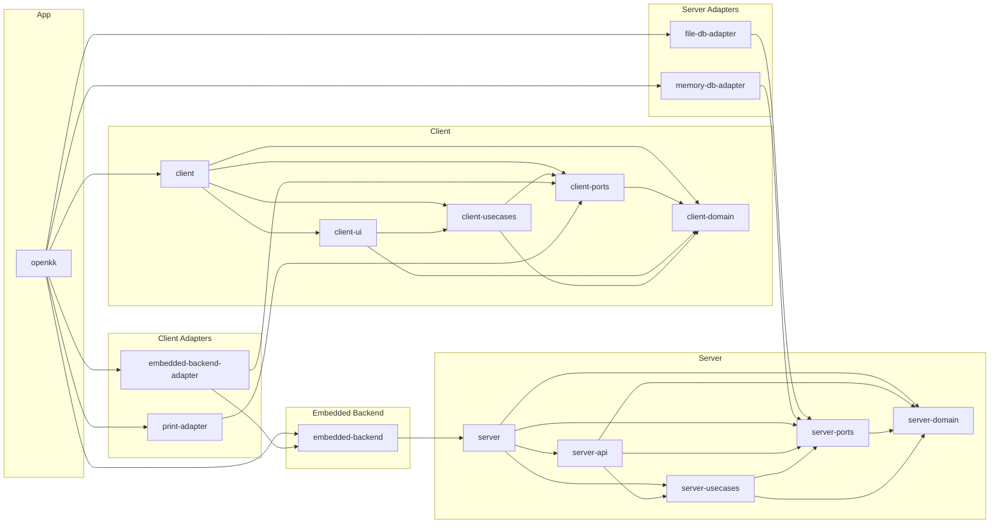

# オープン会計 dependency graph

オープン会計 配下の各 npm パッケージが互いをどう依存しているかをまとめた図です。
パッケージは全て `@rubydogjp/` scope。`@rubydogjp/openkk` がメイン (= App composition root)、それ以外は `@rubydogjp/openkk-<short>` 形式。

## Mermaid graph

GitHub・VSCode の Markdown preview で Mermaid がそのまま render されます。
LR (left-to-right) 方向: 左ほど上位 (composition root)、右ほど下位 (pure domain)。



## グループ説明

| Group | 役割 |
|---|---|
| **App** | リファレンスアプリ。consumer が自前アプリに差し替える |
| **Client Adapters** | `OpenkkBackendPort` / `PrintPort` の実装群。consumer は backend adapter を差し替える |
| **Client** | UI アプリが消費する layer 群。consumer がそのまま流用する |
| **Embedded Backend** | in-process バックエンドの composition root。クラウド利用時は不要 |
| **Server Adapters** | `OpenkkDbPort` の実装群。クラウド利用時は不要 |
| **Server** | server-side host が消費する layer 群。クラウド利用時は不要 |

> **Consumer app が差し替える範囲**
> - **App** グループ → 丸ごと差し替える (自前アプリ)
> - **Client Adapters** の `embedded-backend-adapter` → 自社 HTTP adapter に差し替える
> - **Client** グループ → そのまま流用 (OSS の恩恵)
> - **Embedded Backend / Server Adapters / Server** → 使わない (バックエンドは Cloud Run 等)

## Port interface 命名規則

`*-ports` パッケージで定義される interface は **Port** サフィックス、実装パッケージは **Adapter** サフィックスで区別する。

| Interface (Port) | 定義場所 | 実装パッケージ |
|---|---|---|
| `OpenkkBackendPort` | `client-ports` | `embedded-backend-adapter`、consumer 独自 HTTP adapter |
| `PrintPort` | `client-ports` | `print-adapter` |
| `OpenkkDbPort` | `server-ports` | `file-db-adapter`、`memory-db-adapter` |
| `OpenkkServerPort` | `server-ports` | `server-api` (via `server` meta) |

## Per-package table

| Package | Group | Depends on | Depended by |
|---|---|---|---|
| `@rubydogjp/openkk` | app | `@rubydogjp/openkk-client`, `@rubydogjp/openkk-embedded-backend`, `@rubydogjp/openkk-embedded-backend-adapter`, `@rubydogjp/openkk-file-db-adapter`, `@rubydogjp/openkk-memory-db-adapter`, `@rubydogjp/openkk-print-adapter` | — |
| `@rubydogjp/openkk-client` | client | `@rubydogjp/openkk-client-ports`, `@rubydogjp/openkk-client-domain`, `@rubydogjp/openkk-client-usecases`, `@rubydogjp/openkk-client-ui` | `@rubydogjp/openkk` |
| `@rubydogjp/openkk-client-domain` | client | — | `@rubydogjp/openkk-client`, `@rubydogjp/openkk-client-ports`, `@rubydogjp/openkk-client-ui`, `@rubydogjp/openkk-client-usecases` |
| `@rubydogjp/openkk-client-ports` | client | `@rubydogjp/openkk-client-domain` | `@rubydogjp/openkk-client`, `@rubydogjp/openkk-client-usecases`, `@rubydogjp/openkk-embedded-backend-adapter`, `@rubydogjp/openkk-print-adapter` |
| `@rubydogjp/openkk-client-ui` | client | `@rubydogjp/openkk-client-domain`, `@rubydogjp/openkk-client-usecases` | `@rubydogjp/openkk-client` |
| `@rubydogjp/openkk-client-usecases` | client | `@rubydogjp/openkk-client-ports`, `@rubydogjp/openkk-client-domain` | `@rubydogjp/openkk-client`, `@rubydogjp/openkk-client-ui` |
| `@rubydogjp/openkk-embedded-backend` | embedded_backend | `@rubydogjp/openkk-server` | `@rubydogjp/openkk`, `@rubydogjp/openkk-embedded-backend-adapter` |
| `@rubydogjp/openkk-embedded-backend-adapter` | client_adapters | `@rubydogjp/openkk-client-ports`, `@rubydogjp/openkk-embedded-backend` | `@rubydogjp/openkk` |
| `@rubydogjp/openkk-file-db-adapter` | server_adapters | `@rubydogjp/openkk-server-ports` | `@rubydogjp/openkk` |
| `@rubydogjp/openkk-memory-db-adapter` | server_adapters | `@rubydogjp/openkk-server-ports` | `@rubydogjp/openkk` |
| `@rubydogjp/openkk-print-adapter` | client_adapters | `@rubydogjp/openkk-client-ports` | `@rubydogjp/openkk` |
| `@rubydogjp/openkk-server` | server | `@rubydogjp/openkk-server-ports`, `@rubydogjp/openkk-server-api`, `@rubydogjp/openkk-server-domain`, `@rubydogjp/openkk-server-usecases` | `@rubydogjp/openkk-embedded-backend` |
| `@rubydogjp/openkk-server-api` | server | `@rubydogjp/openkk-server-domain`, `@rubydogjp/openkk-server-ports`, `@rubydogjp/openkk-server-usecases` | `@rubydogjp/openkk-server` |
| `@rubydogjp/openkk-server-domain` | server | — | `@rubydogjp/openkk-server`, `@rubydogjp/openkk-server-api`, `@rubydogjp/openkk-server-ports`, `@rubydogjp/openkk-server-usecases` |
| `@rubydogjp/openkk-server-ports` | server | `@rubydogjp/openkk-server-domain` | `@rubydogjp/openkk-file-db-adapter`, `@rubydogjp/openkk-memory-db-adapter`, `@rubydogjp/openkk-server`, `@rubydogjp/openkk-server-api`, `@rubydogjp/openkk-server-usecases` |
| `@rubydogjp/openkk-server-usecases` | server | `@rubydogjp/openkk-server-ports`, `@rubydogjp/openkk-server-domain` | `@rubydogjp/openkk-server`, `@rubydogjp/openkk-server-api` |

## 再生成

```bash
cd openkk
npm run gen-deps
```
